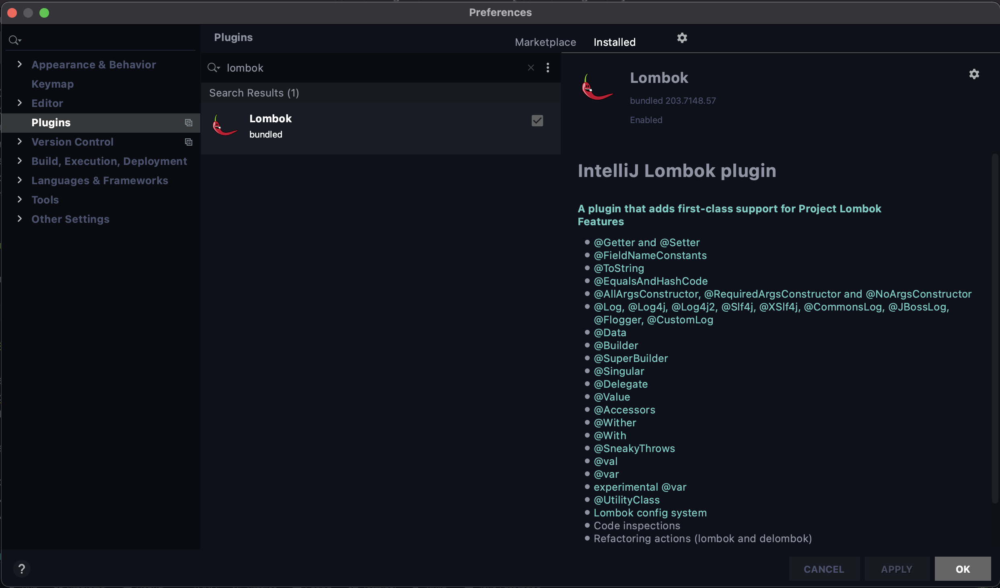
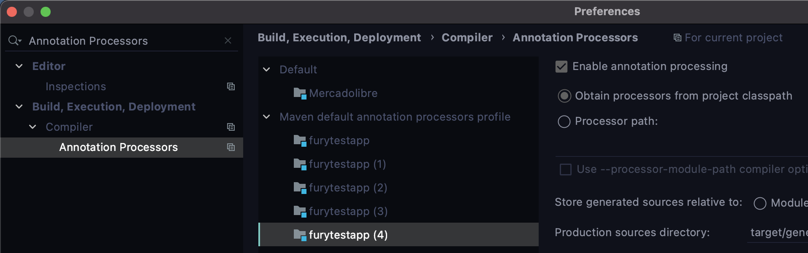

# TECHNICAL ALIGNMENT

## MAVEN

If we make a version change of a library or add a new dependency, we must execute the following command in the terminal, located in the root of the project.

``` shell
mvn clean install -DskipTests
```

## LOMBOK

### Documentation

All Lombok Annotation 
https://projectlombok.org/features/all

### MAVEN Dependency

``` xml
<lombok.version>1.18.16</lombok.version>

<!-- LOMBOK -->
<dependency>
    <groupId>org.projectlombok</groupId>
    <artifactId>lombok</artifactId>
    <version>${lombok.version}</version>
    <scope>provided</scope>
</dependency>
```

### Lombok Plugin

For Lombok to work properly we must install the "lombok" plugin.



### TEST Coverage with Lombok & Jacoco

To cover the coverage percentage you must do 2 things.
* Jacoco's version must be at least 0.8.0
* Create a file in the root of the project called "lombok.config".

In this file add this lines:

``` properties
config.stopBubbling=true
lombok.addLombokGeneratedAnnotation=true
```

### Consider
* If we have problems with the Intellij IDE, and it does not recognize any GET/SET, it is best to close it and reopen it :kissing:
* It is recommended that you review your project's annotation settings. Go to ...
    *  Preference -> Build, Execution, Deployment -> Compile -> Annotation Processors.
    *  The "Enable annotation processing" check of the project must be checked


